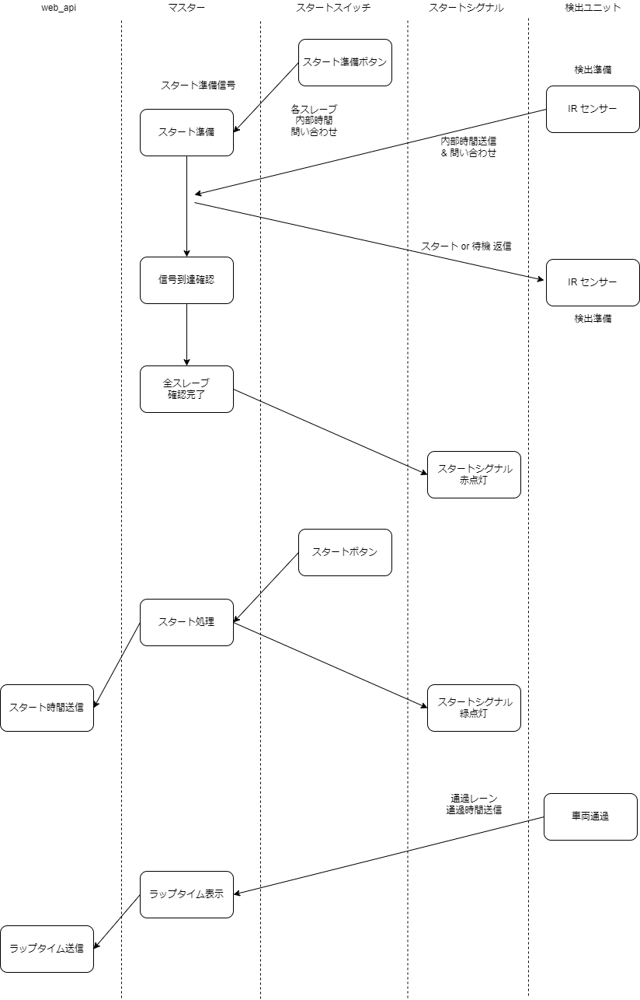

# lap_section_timer
## ラップ&セクションタイマー
---
## 1. 概要
ミニ四駆用ラップ&セクションタイマーです。  
ラップタイム、及びセクションタイムが測定できるように設計してあります。  
1レーン～5レーンまで対応しています。  
スタート、ストップ、スタートシグナルの表示、スタートシグナルの遠隔操作、ラップタイムの表示、web_apiを使用してのwebアプリとの連携を想定しています。  

## 2. 構成
無線通信にesp-nowを使用しているため、基本的に使用するマイコンはesp32を想定しています。  
使用するデバイスと推奨製品はは下記のとおりです。  
※ 推奨基板は()内に記載しています
* マスター (M5ATOM Lite M5 core2) 1台必須  
  コントロール用となります。  
  ※ パソコンから操作する場合はM5ATOM Lite、デバイス単品で操作する場合はM5Core2を推奨します。
* スレーブ (M5ATOM Lite) 1台必須 最大17台  
  ラップタイマーのセンサーユニットとなります。  
  内1台がスタート位置(ラップタイム用)、他がセクションタイム用となります。  
* シグナル表示ユニット(M5ATOM matrix)  最大1台まで
  スタートシグナル表示ユニットになります。  
  見栄えを気にされる方はLEDバーライトを自作されることをおすすめします。  
* 遠隔操作ユニット (M5StickC Plus)  最大1台まで
  遠隔でスタート準備、スタート、ストップを操作出来るようになります。  
  レース等で第三者がスタートシグナルを操作することを想定しています。
* web_apiユニット(M5ATOM Lite) 最大1台  
  マスターとシリアル接続します。
  M5シリーズ同士であればGROVEポートで接続することを想定しています。
  webアプリと連携したいときに使用します。  

## 3. シグナル
各種色の意味は下記のとおりです。
| 色 | 内容 |
| ---- | ---- |
| 赤 | 準備完了 |
| 黄 | 通信エラー |
| 緑 | スタート |

## 4. プロトコル
* esp_now  

| 内容 | 送信 | 受信 | 第1bit | 第2bit | 第3bit | 第5bit | 第6bit | 第7bit | 第8bit |
| ---- | ---- | ---- | ---- | ---- | ---- | ---- | ---- | ---- | ---- |
| ペアリング送信 (ブロードキャスト) | slave | master| 0 |
| ペアリング返信 | slave | master | 1 |
| スタート | master | リモート | 10 |
| シグナル | master | リモート | 11 |
| ストップ | master | リモート | 12 |
| 測定開始 | master | slave | 30 |
| 測定停止 | master | slave | 31 |
| 現在時間受信 | slave | master | 32 | ユニットNo. | 時間(ms) 4bit | 時間(ms) 3bit | 時間(ms) 2bit | 時間(ms) 1bit |
| 通過時間受信 | slave | master | 33 | ユニットNo. | レーンNo. | 時間(ms) 4bit | 時間(ms) 3bit | 時間(ms) 2bit | 時間(ms) 1bit |

   

* Serial  
"\n"(改行)までが1回分の通信となります。  
";"が末尾にあると通信用の出力と判断します。  
各ユニットは","で区切ります。  
ユニット名、値は":"で区切ります。  
例文：
ユニット1:値1,ユニット2:値2,ユニット3,値3;\n

| 内容 | 送信元 | 送信先 | Message | response |
| ---- | ---- | ---- | ---- | ---- |
| スタート指示 | パソコン | master | start; | start_ok; |
| ストップ指示 | パソコン | master | stop; | stop_ok; |
| シグナル指示 | パソコン | master | signal; | signal_ok; |
| ペアリングset | パソコン | master | set:(ユニットNo.); | set_ok; |
| ペアリングreset | パソコン | master | reset:(ユニットNo.); | reset_ok; |
| 通過時間 | master | パソコン | unit:(ユニットNo.),lane:(レーンNo.),time:(ms) | - |

## 5. タイムライン

## 6. プログラム構成
デバイス
* master  
  -> master用
* slave  
  -> slave用 通過センサー用
* signal  
  -> signal用 未着手
* remote  
　-> remote用 未着手  
   

ソフトウェア
* lap_section_timer.py
  -> パソコン用　未着手
